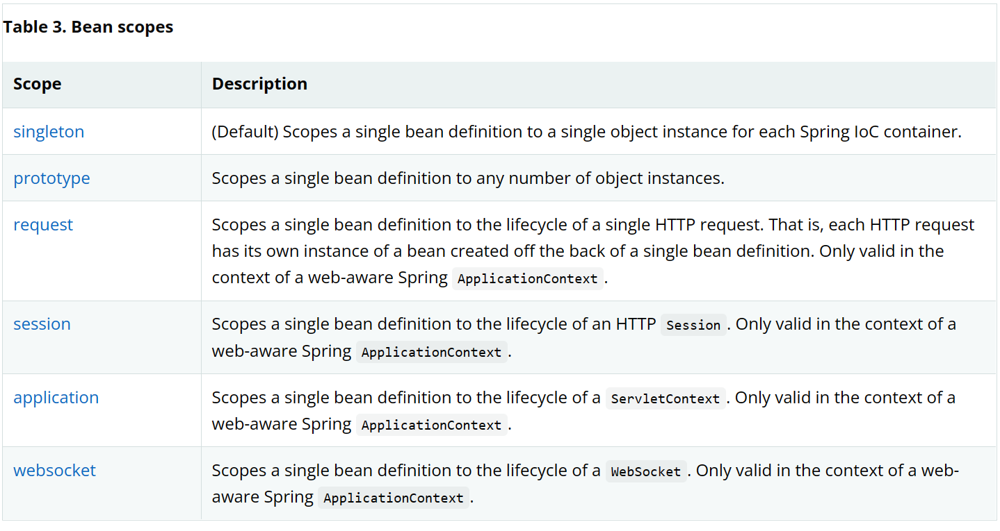
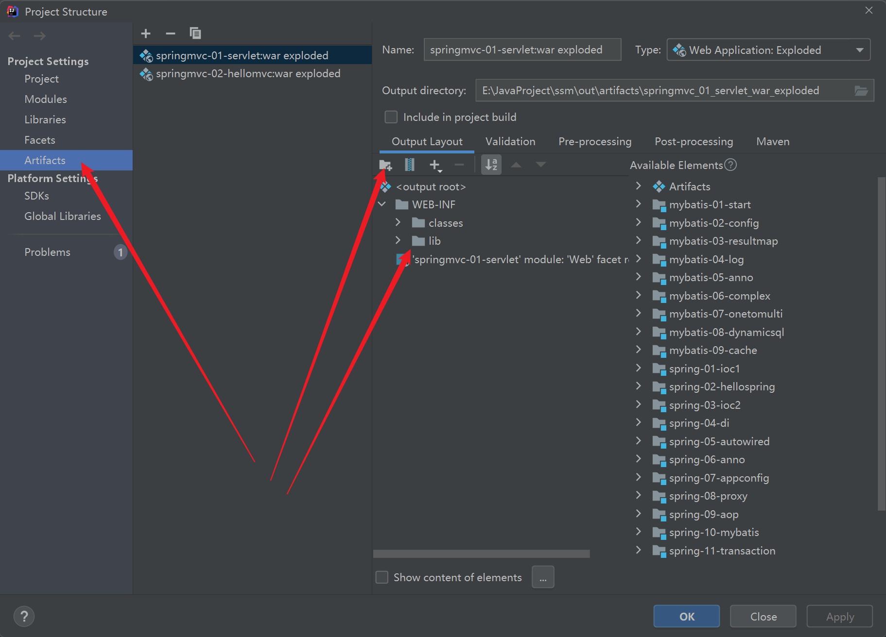
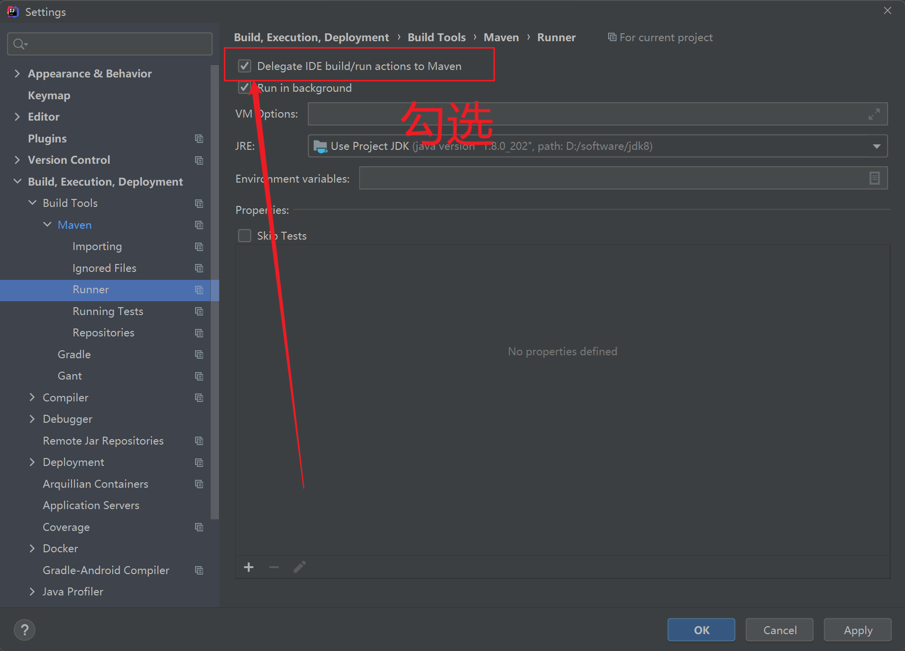

SSM项目包括Spring、Spring MVC、MyBatis的学习源码和笔记。

学习顺序：Mybatis-->Spring-->Spring MVC

# Spring

Spring官网：https://spring.io/

Spring是一个控制反转（IOC）和面向切面编程（AOP）的框架。

IOC是一种设计思想，DI（依赖注入）这是IOC的一种实现方式。

对象由Spring来创建、管理、装配。

> IOC创建对象的方式

默认使用无参构造创建对象，没有将报错。

有参构造使用 `constructor-arg` 来指定。

> Spring配置

配置文件标准名称：applicationContext.xml

别名

```xml

<alias name="user" alias="userNew"/>
```

导入配置文件

```xml

<import resource="beans/xml"/>
```

> DI（依赖注入）

构造器注入

Set方式注入

+ 依赖：bean对象的创建依赖于容器
+ 注入：bean对象中的所有属性，由容器来注入

扩展方式注入(需要导入约束)

+ p命名空间
+ c命名空间

> bean的作用域



> 自动装配

Spring会在上下文中自动寻找，并自动给bean装配属性

使用注解自动装配

+ 导入约束
+ 配置注解支持

```xml
<?xml version="1.0" encoding="UTF-8"?>
<beans xmlns="http://www.springframework.org/schema/beans"
       xmlns:xsi="http://www.w3.org/2001/XMLSchema-instance"
       xmlns:context="http://www.springframework.org/schema/context"
       xsi:schemaLocation="http://www.springframework.org/schema/beans
        https://www.springframework.org/schema/beans/spring-beans.xsd
        http://www.springframework.org/schema/context
        https://www.springframework.org/schema/context/spring-context.xsd">

    <context:annotation-config/>

</beans>
```

```java
// 当有多个bean时，可以指定需要的bean
@Qualifier(value = "dog")
```

`@Resource` 注解会先根据id查找，找不到就根据class查找，都找不到就报错。 也可以使用 `name` 指定bean

> 注解开发

在Spring4之后，注解开发需要导入aop包

注解跟配置是一一对应的，每一个配置都可以使用相应的注解代替。

最佳实践

+ xml用来管理bean
+ 注解只负责完成属性的注入

> Java配置类

@Configuration 注解

> 静态代理

1. 接口
2. 真实角色
3. 代理角色
4. 客户端访问代理对象

优点：

+ 真实角色不用关注公共业务
+ 公共业务交给代理实现
+ 公共业务发生扩展时，方便集中管理

缺点：

+ 一个真实角色就会产生一个代理角色，代码量翻倍

> 动态代理

+ 基于接口：JDK动态代理
+ 基于类：cglib
+ Java字节码实现：Javasist

> Spring AOP

+ 使用Spring的API接口
+ 自定义来实现AOP
+ 使用注解实现

> 事务

ACID

+ 原子性
+ 一致性
+ 隔离性
+ 持久性

# Spring MVC

MVC架构

+ 模型：dao/mapper、service
+ 视图：jsp、html
+ 控制器：servlet、controller

在回顾servlet时出现404问题，解决方案：使用tomcat9而不是tomcat10
https://blog.csdn.net/CQIPC_yyy/article/details/125949619

**约定优于配置**

hellomvc报404，手动添加lib


Tomcat控制台输出乱码：修改 `conf\logging.properties` 文件

```properties
# 修改为GBK
java.util.logging.ConsoleHandler.encoding=GBK
```

# MyBatis

https://mybatis.org/mybatis-3/zh/

持久层：完成持久化工作的代码块

> 环境搭建

数据库

```sql
CREATE
DATABASE `mybatis`;

USE
`mybatis`;
CREATE TABLE `user`
(
    `id`       INT(20) NOT NULL PRIMARY KEY,
    `name`     VARCHAR(30) DEFAULT NULL,
    `password` VARCHAR(30) DEFAULT NULL
)ENGINE=INNODB DEFAULT CHARSET=utf8;

INSERT INTO `user`(`id`, `name`, `password`)
VALUES (1, '张三', '123456'),
       (2, '李四', '123456'),
       (3, '王五', '123456'),
       (4, '赵六', '123456')
```

模糊查询需要注意SQL注入

> 日志

```xml

<settings>
    <setting name="logImpl" value="STDOUT_LOGGING"/>
</settings>
```

log4j配置

```properties
### set log levels ###
log4j.rootLogger=debug,stdout,file
### 输出到控制台 ###
log4j.appender.stdout=org.apache.log4j.ConsoleAppender
log4j.appender.stdout.Target=System.out
log4j.appender.stdout.layout=org.apache.log4j.PatternLayout
log4j.appender.stdout.layout.ConversionPattern=%d{ABSOLUTE} %5p %c{1}:%L - %m%n
### 输出到日志文件 ###
log4j.appender.file=org.apache.log4j.DailyRollingFileAppender
log4j.appender.file.File=logs/log.log
log4j.appender.file.Append=true
log4j.appender.file.Threshold=DEBUG
log4j.appender.file.layout=org.apache.log4j.PatternLayout
log4j.appender.file.layout.ConversionPattern=%-d{yyyy-MM-dd HH:mm:ss}  [ %t:%r ] - [ %p ]  %m%n
```

> 分页

+ limit
+ RowBounds
+ PageHelper

> 复杂查询

```sql
CREATE TABLE `teacher`
(
    `id`   INT(10) NOT NULL,
    `name` VARCHAR(30) DEFAULT NULL,
    PRIMARY KEY (`id`)
)ENGINE=INNODB DEFAULT CHARSET=utf8;

INSERT INTO teacher(`id`, `name`)
VALUES (1, '王老师');

CREATE TABLE `student`
(
    `id`   INT(10) NOT NULL,
    `name` VARCHAR(30) DEFAULT NULL,
    `tid`  INT(10) DEFAULT NULL,
    PRIMARY KEY (`id`),
    KEY    `fktid`(`tid`),
    CONSTRAINT `fktid` FOREIGN KEY (`tid`) REFERENCES `teacher` (`id`)
)ENGINE=INNODB DEFAULT CHARSET=utf8;

INSERT INTO `student`(`id`, `name`, `tid`)
VALUES (1, "小明", 1);
INSERT INTO `student`(`id`, `name`, `tid`)
VALUES (2, "小红", 1);
INSERT INTO `student`(`id`, `name`, `tid`)
VALUES (3, "小张", 1);
INSERT INTO `student`(`id`, `name`, `tid`)
VALUES (4, "小李", 1);
INSERT INTO `student`(`id`, `name`, `tid`)
VALUES (5, "小周", 1);
```

```sql
CREATE TABLE `blog`
(
    `id`          VARCHAR(50)  NOT NULL COMMENT '博客id',
    `title`       VARCHAR(100) NOT NULL COMMENT '博客标题',
    `author`      VARCHAR(30)  NOT NULL COMMENT '博客作者',
    `create_time` DATETIME     NOT NULL COMMENT '创建时间',
    `views`       INT(30) NOT NULL COMMENT '浏览量'
)ENGINE=INNODB DEFAULT CHARSET=utf8;
```

> 缓存

缓存失效

+ 查询条件不同
+ 数据有更新
+ 清理缓存

一级缓存：什么都不用做，默认存在

二级缓存

```xml
<!--核心配置文件-->
<setting name="cacheEnabled" value="true"/>
        <!--mapper.xml文件 方法标签加上useCache="true"-->
<cache eviction="FIFO"
       flushInterval="60000"
       size="512"
       readOnly="true"/>

```

自定义ehcache

导入maven依赖

```xml
<!-- https://mvnrepository.com/artifact/org.mybatis.caches/mybatis-ehcache -->
<dependency>
    <groupId>org.mybatis.caches</groupId>
    <artifactId>mybatis-ehcache</artifactId>
    <version>1.2.3</version>
</dependency>


```

配置文件

指定缓存

```xml

<cache type="org.mybatis.caches.ehcache.EhcacheCache"/>
```

# SSM整合

数据库

```sql
CREATE
DATABASE `ssmbuild`;

USE
`ssmbuild`;

DROP TABLE IF EXISTS `books`;

CREATE TABLE `books`
(
    `book_id`     INT(10) NOT NULL AUTO_INCREMENT COMMENT '书id',
    `book_name`   VARCHAR(100) NOT NULL COMMENT '书名',
    `book_counts` INT(11) NOT NULL COMMENT '描述',
    `detail`      VARCHAR(200) NOT NULL COMMENT '描述',
    KEY           `book_id` (`book_id`)
)ENGINE=INNODB DEFAULT CHARSET=utf8;

INSERT INTO `books`(`book_id`, `book_name`, `book_counts`, `detail`)
VALUES (1, 'Java', 1, '从入门到放弃'),
       (2, 'MySQL', 20, '从删库到跑路'),
       (3, 'Linux', 4, '从进门到坐牢');
```

maven

+ 依赖
+ 静态资源导出

问题：`org.springframework.beans.factory.CannotLoadBeanClassException: Error loading class [org.mybatis.spring.SqlSessionFactoryBean] for bean with name 'sqlSessionFactory' defined in class path resource [spring-mapper.xml]: problem with class file or dependent class; nested exception is java.lang.UnsupportedClassVersionError: org/mybatis/spring/SqlSessionFactoryBean has been compiled by a more recent version of the Java Runtime (class file version 61.0), this version of the Java Runtime only recognizes class file versions up to 52.0`

原因：依赖版本不一致

问题：`org.springframework.context.annotation` 不存在 解决方案：


> Ajax


